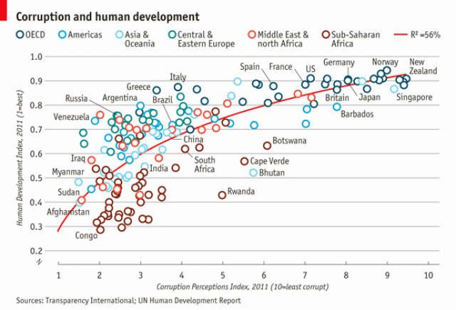

```{r setup, include=FALSE}
library(learnr)
knitr::opts_chunk$set(echo = FALSE)
library(tidyverse)
econ_data <- read_csv('www/EconomistData.csv')
theme_set(theme_bw())

```


## An example 

<div id="origecon"></div>



## Let's start with a basic plot of the data

The data is already pre-loaded. 

```{r a1, exercise = TRUE, echo = T, exercise.eval=TRUE}

ggplot(econ_data,
       aes(x = CPI, y = HDI, color=Region))+
  geom_point()
```


## Add a trend line

```{r a2, exercise=TRUE,  echo = T}
ggplot(econ_data,
       aes(x = CPI, y = HDI, color=Region))+
  geom_point() +
  geom_smooth(color='red', se=T)
```

Note that this uses a lowess smoother. Can you modify the code to change the smoother to a quadratic 
polynomial, so that it's closer to the original graph? Also, can you get rid of the confidence bands, for a cleaner graph?

```{r a2-solution}
ggplot(econ_data,
       aes(x = CPI, y = HDI, color=Region))+
  geom_point() +
  geom_smooth(color='red', se=F, method = 'lm', formula = y~poly(x,2))
```


## Ordering layers

If you look at the original plot, the points are drawn on top of the line. We can achieve this by 
reversing the order of the line and points in the ggplot code. 

```{r a3, exercise=TRUE, echo = T, message=F}
ggplot(econ_data,
       aes(x = CPI, y = HDI, color=Region))+
  geom_smooth(color='red', se=F, method='lm', formula = y~poly(x,2)) +
  geom_point()
```


## Let's mimic the style of the points

Play around with the size and stroke options in `geom_point` to change the look of the points
```{r a4, exercise=TRUE, exercise.eval=TRUE, echo = T}
ggplot(econ_data,
       aes(x = CPI, y = HDI, color=Region))+
  geom_smooth(color='red', se=F, method = 'lm', formula = y~poly(x,2)) + 
  geom_point(shape = 1, size = 2, stroke=1)

```


---

## Now let's add labels of the countries

```{r a5, eval=T, echo = T}
ggplot(econ_data,
       aes(x = CPI, y = HDI, color=Region))+
  geom_smooth(color='red', se=F, method='lm', formula = y~poly(x,2)) + 
  geom_point(shape = 1, size = 4, stroke=1.25) + 
  geom_text(aes(label=Country),
            color = 'gray20')
```


Oh boy!!! Let's see if we can cull this mess down

One important tool here is that in any `geom`, you can update the data set, as long as the variables and 
general context are the same as the base plot. We take advantage of this to limit the set of countries that
get labels.

You can further select which countries get labeled to see if the plot can be cleaner.

Also, see what happens if you replace `geom_text` with `geom_label`

```{r a6,exercise=TRUE, echo = T}
pointsToLabel <- c("Russia", "Venezuela", "Iraq", "Myanmar", "Sudan",
                   "Afghanistan", "Congo", "Greece", "Argentina", "Brazil",
                   "India", "Italy", "China", "South Africa", "Spain",
                   "Botswana", "Cape Verde", "Bhutan", "Rwanda", "France",
                   "United States", "Germany", "Britain", "Barbados", "Norway", "Japan",
                   "New Zealand", "Singapore")
ggplot(econ_data,
       aes(x = CPI, y = HDI, color=Region))+
  geom_smooth(color='red', se=F, method = 'lm', formula = y~poly(x,2)) + 
  geom_point(shape = 1, size = 4, stroke=1.25) + 
  geom_text(aes(label=Country),
            color = 'gray20', 
            data = econ_data %>% 
              dplyr::filter(Country %in% pointsToLabel))
```

You can also play around with the text color to see what happens. `gray20` means 20% gray. 


## Reducing overlay of points and labels

We need to move the labels off the actual points to make them easier to read. We'll use the **ggrepel** library to help make sure we have less overlap in the graph elements

```{r a7, exercise=TRUE, exercise.eval=FALSE, echo = T}
library(ggrepel) 
pointsToLabel <- c("Russia", "Venezuela", "Iraq", "Myanmar", "Sudan",
                   "Afghanistan", "Congo", "Greece", "Argentina", "Brazil",
                   "India", "Italy", "China", "South Africa", "Spane",
                   "Botswana", "Cape Verde", "Bhutan", "Rwanda", "France",
                   "United States", "Germany", "Britain", "Barbados", "Norway", "Japan",
                   "New Zealand", "Singapore")
(plt <- ggplot(econ_data,
       aes(x = CPI, y = HDI, color=Region))+
  geom_smooth(color='red', se=F, method='lm', formula = y~poly(x,2)) + 
  geom_point(shape = 1, size = 4, stroke=1.25) + 
  geom_text_repel(aes(label=Country),#<<
            color = 'gray20', 
            force=10,
            data = econ_data %>% 
              dplyr::____(________)))
```

Play around with the `force=` option to see how that will affect where the labels are placed. This parameter 
controls the _repulsive force_ between the labels. 

Note that we are now saving the plot in the variable `plt`. This can come in useful as we further tweak the graph

## Re-labeling the regions

In order to match the region names with the original graph, we need to do a bit of recoding of the factor.

The following code uses the `factor` function to explicitly reset the labels, and updates the plot just by updating the data element of the `plt` object. 


We can also do this same data transformation using functions from the ** forcats** package. Change the code for data transformation to use pipes and functions from the **forcats** package. 

Note that we have a bunch of `\n` in the labels. This stands for _newline_ and 
will put a line break at that point.

```{r a8, exercise=TRUE, exercise.eval=TRUE, echo = T, exercise.lines = 30, exercise.setup='a7'}
econ_data$Region <- 
  factor(econ_data$Region,
         levels = c("EU W. Europe",
                    "Americas",
                    "Asia Pacific",
                    "East EU Cemt Asia",
                    "MENA",
                    "SSA"),
         labels = c("OECD",
                    "Americas",
                    "Asia &\nOceania",
                    "Central &\nEastern Europe",
                    "Middle East &\nnorth Africa",
                    "Sub-Saharan\nAfrica"))

plt$data = econ_data 
plt 
```

```{r a8-hint-1}
econ_data <- econ_data %>% 
  mutate(Region = fct_recode(Region,
    'OECD' = 'EU W. Europe', 
    'Asia &\nOceania' = 'Asia Pacific', 
    'Central &\nEastern Europe' = 'East EU Cemt Asia', 
    'Middle East &\nNorth Africa'='MENA', 
    'Sub-Saharan\nAfrica' = 'SSA'
  ))

plt$data <-  econ_data
plt
```
```{r, a8-hint-2}
econ_data <- econ_data %>% 
  mutate(Region = fct_recode(Region,
    'OECD' = 'EU W. Europe', 
    'Asia &\nOceania' = 'Asia Pacific', 
    'Central &\nEastern Europe' = 'East EU Cemt Asia', 
    'Middle East &\nNorth Africa'='MENA', 
    'Sub-Saharan\nAfrica' = 'SSA'
  )) %>% 
  mutate(Region = fct_relevel(Region,
                     "OECD",
                    "Americas",
                    "Asia &\nOceania",
                    "Central &\nEastern Europe",
                    "Middle East &\nNorth Africa",
                    "Sub-Saharan\nAfrica"))

plt$data <- econ_data
plt
```

```{r a9setup, echo=FALSE, results='hide'}
econ_data <- econ_data %>% 
  mutate(Region = fct_recode(Region,
    'OECD' = 'EU W. Europe', 
    'Asia &\nOceania' = 'Asia Pacific', 
    'Central &\nEastern Europe' = 'East EU Cemt Asia', 
    'Middle East &\nNorth Africa'='MENA', 
    'Sub-Saharan\nAfrica' = 'SSA'
  )) %>% 
  mutate(Region = fct_relevel(Region,
                     "OECD",
                    "Americas",
                    "Asia &\nOceania",
                    "Central &\nEastern Europe",
                    "Middle East &\nNorth Africa",
                    "Sub-Saharan\nAfrica"))

plt$data <- econ_data
```


## Position of the legend

```{r a9, echo=TRUE, exercise=TRUE, exercise.setup='a9setup'}
plt + theme(legend.____ = 'top',
            legend.____ = 'horizontal')
```

```{r a9-solution}
plt + theme(legend.position = 'top',
            legend.direction = 'horizontal')
```


```{r a10-setup, echo=FALSE, results='hide'}
plt=plt + theme(legend.position = 'top',
            legend.direction = 'horizontal')
```

## Updating colors

You can actually customize colors of the points by specifying the colors in order of
the factor levels. You can specify colors in 3 ways

1. By name (like `blue`, `periwinkle`, `chartreuse`, etc.)
1. By RGB code
    - RGB is relative levels of red, green and blue, and is a common way of designating colors in visual media. 
    - You would specify it by `rgb(100,0,34)` as the levels of red, green and blue on a scale between 0 and 255.
1. By hex code
    - These are 6 alphanumeric characters (0-9, A-F) that also specify red, green and blue levels, with 2 characters for each color
    - Hex codes or hexadecimal codes, allow for 16 possibilities per "digit", so 0,1, ..., 9, A, ..., F gives 16 values. 2 such digits gives 16x16=256 possible values.
    
How do you figure these out? Couple of sites I use are [https://www.color-hex.com](https://www.color-hex.com) and 
[https://www.w3schools.com/colors/colors_picker.asp](https://www.w3schools.com/colors/colors_picker.asp)

```{r a10, exercise=TRUE, exercise.eval=TRUE, echo=TRUE, exercise.setup = 'a10-setup'}
(plt <- plt + scale_color_manual(name = '',
                         values = c("#24576D",
                                "#099DD7",
                                "#28AADC",
                                "#248E84",
                                "#F2583F",
                                "#96503F")))
```

```{r a11-setup, echo=FALSE, results='hide'}
plt <- plt + scale_color_manual(name = '',
                         values = c("#24576D",
                                "#099DD7",
                                "#28AADC",
                                "#248E84",
                                "#F2583F",
                                "#96503F"))
```

## Final cleaning

You can now add the labels and titles to make this plot like the original. For a reminder, here is the original
plot


```{r a11, exercise=TRUE, exercise.eval=FALSE, exercise.setup = 'a11-setup'}

(plt_corrupt <- 
   plt +
  scale_x_continuous() +
  scale_y_continuous()+
  ggtitle("Corruption and Human development")+
  theme_bw()
)
```


